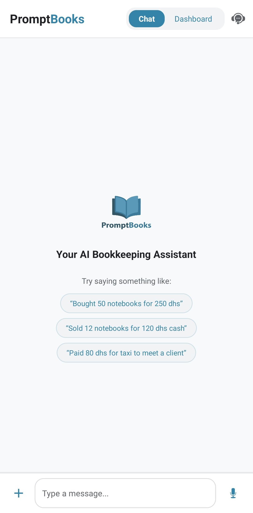
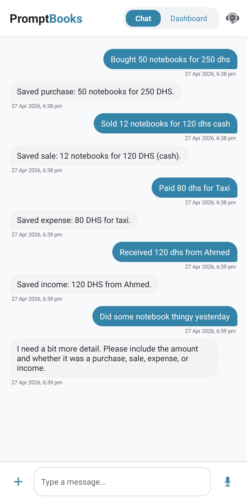
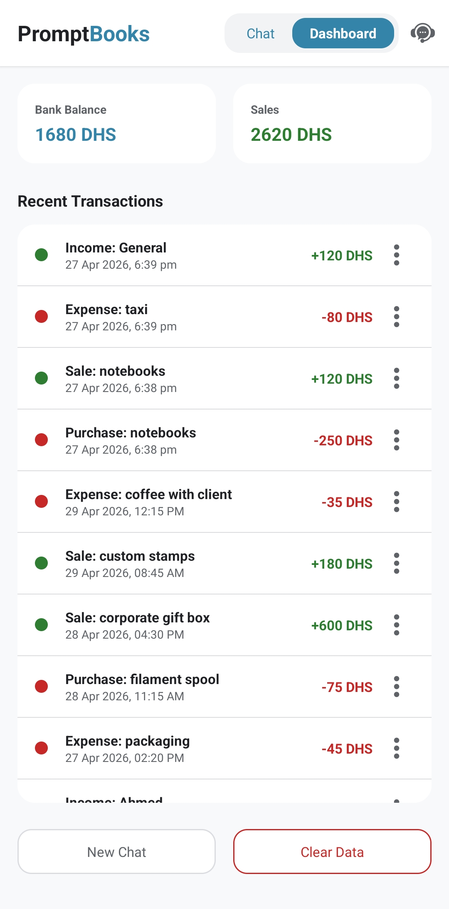

[](./)
[](./LICENSE)
[](https://github.com/joravarsinghing/PromptBooks/releases/tag/v1.00.00)

# PromptBooks

---

<table border="0">
  <tr>
    <td style="border: none;" width="20%">
      
    </td>
    <td style="border: none;">
      <b>PromptBooks</b> is a chat-first Android bookkeeping proof-of-concept where users log transactions in natural language and the app converts them into structured local records. It demonstrates a practical AI-assisted flow from intent interpretation to dashboard reflection while keeping accounting logic app-owned.
    </td>
  </tr>
</table>

---
## Screenshots


<p align="center">
  
  
  
</p>

---

## Access & Download

- **Source Code:** [GitHub Repository](./)
- **Releases:** [GitHub Releases](https://github.com/joravarsinghing/PromptBooks/releases)
- **Roadmap:** [ROADMAP.md](./ROADMAP.md)

---

## Unique Selling Points

- **AI as interpreter, not accountant:** AI extracts intent and fields; app logic owns final calculations and persistence.
- **Chat-first bookkeeping UX:** A lightweight conversation flow lowers friction for transaction capture.
- **Demo credibility focus:** Includes guardrails, structured data storage, dashboard reflection, and reset tooling for live demos.

---

## Features & Usage

- **Transaction Capture**
  - Natural-language input in chat.
  - Guardrail blocks vague entries before API calls.
  - AI interpretation maps user text to structured transaction fields.
- **Data & Dashboard**
  - Transactions saved locally with Room.
  - Dashboard shows **Bank Balance**, **Sales**, and **Recent Transactions**.
  - Date/time shown for dashboard rows.
- **Demo Utilities**
  - Per-row delete via 3-dot menu.
  - **Clear Data** for full demo reset.
  - **New Chat** clears visible chat only.
  - **Generate Sample Data** from support popup.
  - Placeholder popups for attachment and mic actions.

---

## Tech Stack

- **Language:** Kotlin
- **UI:** XML Layouts + Fragments
- **Architecture:** Fragment-driven (lightweight, non-MVVM)
- **Networking:** Retrofit
- **AI Provider:** OpenRouter API
- **Local Database:** Room
- **Build:** Gradle Kotlin DSL
- **Theme:** AppCompat (Light)
- **Main Package:** `com.example.promptbooks`

**Pinned MVP versions:** Gradle `8.10.2`, AGP `8.6.1`, Kotlin `1.9.24`, Room `2.6.1`.

---

## Installation & Development

1. Clone the repository:
   ```bash
   git clone <YOUR_REPO_URL>
   cd PromptBooks
   ```
2. Open the project in **Android Studio Ladybug** (or a compatible version supporting AGP `8.6.1`).
3. Add your API key in `local.properties`:
   ```properties
   OPENROUTER_API_KEY=your_key_here
   ```
4. Ensure your app exposes the key via `BuildConfig.OPENROUTER_API_KEY`.
5. Build and run on an emulator or Android device.

---

## AI Design Principles

- **AI = interpreter only.**
- The app owns database writes, dashboard computations, confirmation wording, guardrails, and display formatting.
- Authoritative totals must come from app logic, not model-generated math.

---

## Privacy & Security

- **Local-first data handling:** transactions are stored locally using Room.
- **No hardcoded secrets:** API keys must not be embedded in Kotlin source.
- **Permissions:** network access is required for AI calls; storage and microphone features are currently placeholder UX flows.
- **Key safety:** never commit real API keys to version control.

---

## Scope Notes

Deliberately out of scope for this MVP:

- Attachment parsing or OCR
- Real voice input
- Reports or PDF export
- Bank sync or Zoho Books integration
- Multi-user accounts and production accounting rules
- Full transaction edit/detail popup (planned in Milestone 2)

---


## License

This project is licensed under the **MIT License**. See [LICENSE](./LICENSE) for details.

